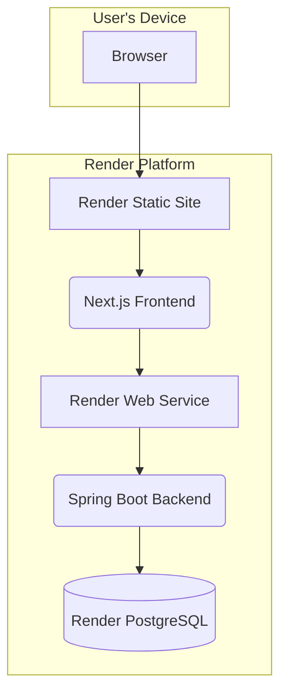

-----

# **Farm-to-Buyer Direct Platform Fullstack Architecture Document**

### **1. Introduction**

This document outlines the complete fullstack architecture for the Farm-to-Buyer Direct Platform, including backend systems, frontend implementation, and their integration. It serves as the single source of truth for AI-driven development, ensuring consistency across the entire technology stack.

#### **Starter Template or Existing Project**

The project will be built using standard starter templates for both the frontend and backend, which will be integrated into a monorepo structure.

  * **Backend (Spring Boot):** The initial application will be generated using `start.spring.io`, configured with the necessary dependencies for a modern web application.
  * **Frontend (React):** The application will be initialized using the standard **Next.js** starter template (`npx create-next-app@latest`).

#### **Change Log**

| Date | Version | Description | Author |
| :--- | :--- | :--- | :--- |
| 2025-07-12 | 1.0 | Initial architecture draft created. | Winston (Architect) |

### **2. High Level Architecture (Revised)**

#### **Technical Summary**

This architecture outlines a modern, cloud-native web application designed for scalability and rapid development. The system features a decoupled frontend (Next.js) and backend (Spring Boot) housed within a monorepo to streamline development. Communication occurs via a secure REST API. The entire platform will be deployed on **Render**, leveraging its managed services to ensure reliability and focus on business logic.

#### **Platform and Infrastructure Choice**

The project will be deployed on the **Render** cloud platform, which provides an integrated environment for web applications, services, and databases.

  * **Key Services:**
      * **Static Site:** For hosting the Next.js frontend, providing a global CDN and continuous deployment from our Git repository.
      * **Web Service:** For hosting the Spring Boot backend, providing a scalable, managed environment.
      * **PostgreSQL:** For our managed database instance.

#### **Repository Structure**

As decided in the PRD, we will use a **Monorepo**.

  * **Monorepo Tool:** We will use **Turborepo** to manage the monorepo, which will help us manage the independent build and deployment processes for our frontend and backend services on Render.
  * **Package Organization:** The monorepo will contain separate packages for the `frontend` application, the `backend` application, and a `shared` package for common code and types.

#### **High Level Architecture Diagram**



#### **Architectural Patterns**

  * **Cloud-Native Application:** The system is designed to leverage a modern cloud platform (Render) for hosting, data, and deployment.
  * **Decoupled Frontend/Backend:** The React/Next.js frontend is a separate application from the Spring Boot backend, allowing them to be developed, deployed, and scaled independently on Render.
  * **Direct Service Communication:** The frontend application will communicate directly with the backend Web Service's public URL. Security and access control will be managed at the application level via authentication tokens.
  * **Repository Pattern (Backend):** The backend will use the repository pattern to abstract data access logic, making the application more modular and easier to test.

### **3. Tech Stack**

#### **Technology Stack Table**

| Category | Technology | Version | Purpose | Rationale |
| :--- | :--- | :--- | :--- | :--- |
| **Frontend Language** | TypeScript | `5.4+` | Language for frontend code | Provides type safety and scalability for React. |
| **Frontend Framework**| Next.js | `14.2+` | Primary React framework | Production-ready features like routing and SSR. |
| **UI Component Lib** | shadcn/ui | `Latest` | Accessible & composable components | Modern, unstyled components for custom branding. |
| **State Management**| Zustand | `4.5+` | Frontend state management | Lightweight and simple for managing global state. |
| **Backend Language** | Java | `17` | Language for backend code | LTS version, robust, great for enterprise apps. |
| **Backend Framework**| Spring Boot | `3.3+` | Primary backend framework | Rapid development of REST APIs, strong ecosystem. |
| **API Style** | REST | `N/A` | API communication style | Standard, well-understood, and tool-agnostic. |
| **Database** | PostgreSQL | `16` | Primary data store | Powerful, open-source relational database. |
| **File Storage** | Cloudinary | `Free Tier` | Storing uploaded produce images | Simple API and generous free tier for MVP. |
| **Authentication** | Spring Security | `6.3+` | Backend authentication & auth | Standard for securing Spring applications. |
| **Frontend Testing**| Jest & RTL | `Latest` | Component & unit testing | Industry standard for testing React components. |
| **Backend Testing** | JUnit 5 & Mockito |`Latest`| Unit & integration testing | Standard for testing Java/Spring applications. |
| **E2E Testing** | Playwright |`Latest`| End-to-end browser testing| Modern, reliable testing across all browsers. |
| **IaC Tool** | Render Blueprints |`render.yaml`| Infrastructure as Code | Native to Render for defining all services. |
| **CI/CD** | GitHub Actions |`N/A`| Continuous Integration/Deployment| Integrates directly with our code repository. |

### **4. Data Models (Final Version)**

#### **User Model**

  * **Purpose:** Represents any individual registered on the platform.
  * **Key Attributes:** `id`, `fullName`, `email`, `passwordHash`, `region`, `role`, `phoneNumber`, `deliveryAddress`, `averageRating`, `ratingCount`, `accountStatus`, `createdAt`, `updatedAt`.
  * **TypeScript Interface:**
    ```typescript
    interface Address {
      street: string;
      town: string;
      gpsAddress?: string;
    }

    interface User {
      id: string;
      fullName: string;
      email: string;
      phoneNumber: string;
      region: string;
      role: 'BUYER' | 'FARMER' | 'ADMIN';
      accountStatus: 'ACTIVE' | 'SUSPENDED';
      deliveryAddress?: Address;
      averageRating?: number;
      ratingCount?: number;
      createdAt: Date;
      updatedAt: Date;
    }
    ```

#### **Product Model**

  * **Purpose:** Represents an item of produce listed for sale.
  * **Key Attributes:** `id`, `name`, `description`, `price`, `unit`, `harvestDate`, `stockQuantity`, `listingStatus`, `imageUrls`, `farmerId`, `categoryId`, `createdAt`, `updatedAt`.
  * **TypeScript Interface:**
    ```typescript
    interface Product {
      id: string;
      name: string;
      description: string;
      price: number;
      unit: string;
      harvestDate: Date;
      stockQuantity: number;
      listingStatus: 'ACTIVE' | 'INACTIVE' | 'SOLD_OUT';
      imageUrls: string[];
      farmer: User;
      category: Category;
      createdAt: Date;
      updatedAt: Date;
    }
    ```

#### **Order Model**

  * **Purpose:** Represents a single transaction initiated by a buyer.
  * **Key Attributes:** `id`, `buyerId`, `status`, `itemsSubtotal`, `deliveryFee`, `finalTotal`, `paymentStatus`, `fulfillmentType`, `deliveryAddress`, `pickupLocationId`, `createdAt`, `updatedAt`.
  * **TypeScript Interface:**
    ```typescript
    interface Order {
      id: string;
      buyerId: string;
      status: 'PENDING' | 'READY_FOR_PICKUP' | 'OUT_FOR_DELIVERY' | 'COMPLETED' | 'DISPUTED';
      itemsSubtotal: number;
      deliveryFee: number;
      finalTotal: number;
      paymentStatus: 'UNPAID' | 'PAID';
      fulfillmentType: 'DELIVERY' | 'PICKUP';
      deliveryAddress?: Address;
      pickupLocationId?: string;
      items: OrderItem[];
      createdAt: Date;
      updatedAt: Date;
    }
    ```

#### **OrderItem Model**

  * **Purpose:** Represents a single line item within an `Order`.
  * **Key Attributes:** `id`, `orderId`, `productId`, `quantity`, `priceAtPurchase`, `createdAt`, `updatedAt`.
  * **TypeScript Interface:**
    ```typescript
    interface OrderItem {
      id: string;
      orderId: string;
      product: Product;
      quantity: number;
      priceAtPurchase: number;
      createdAt: Date;
      updatedAt: Date;
    }
    ```

#### **Category Model**

  * **Purpose:** To organize produce listings into groups.
  * **Key Attributes:** `id`, `name`, `description`, `createdAt`, `updatedAt`.
  * **TypeScript Interface:**
    ```typescript
    interface Category {
      id: string;
      name: string;
      description?: string;
      createdAt: Date;
      updatedAt: Date;
    }
    ```

#### **PickupLocation Model**

  * **Purpose:** To store the details of physical order pickup locations.
  * **Key Attributes:** `id`, `name`, `address`, `region`, `operatingHours`, `createdAt`, `updatedAt`.
  * **TypeScript Interface:**
    ```typescript
    interface PickupLocation {
      id: string;
      name: string;
      address: Address;
      region: string;
      operatingHours: string;
      createdAt: Date;
      updatedAt: Date;
    }
    ```

#### **Rating Model**

  * **Purpose:** To store a single rating instance from a buyer for a farmer.
  * **Key Attributes:** `id`, `score`, `comment`, `orderId`, `buyerId`, `farmerId`, `createdAt`, `updatedAt`.
  * **TypeScript Interface:**
    ```typescript
    interface Rating {
      id: string;
      score: 1 | 2 | 3 | 4 | 5;
      comment?: string;
      orderId: string;
      buyerId: string;
      farmerId: string;
      createdAt: Date;
      updatedAt: Date;
    }
    ```

#### **Dispute Model**

  * **Purpose:** To track the details of a buyer's issue with an order.
  * **Key Attributes:** `id`, `orderId`, `reason`, `status`, `resolutionNotes`, `createdAt`, `updatedAt`.
  * **TypeScript Interface:**
    ```typescript
    interface Dispute {
      id: string;
      orderId: string;
      reason: string;
      status: 'OPEN' | 'UNDER_REVIEW' | 'RESOLVED';
      resolutionNotes?: string;
      createdAt: Date;
      updatedAt: Date;
    }
    ```

### **5. API Specification (Final Version)**

```yaml
openapi: 3.0.1
info:
  title: "Farm-to-Buyer Direct Platform API"
  description: "API for the Farm-to-Buyer platform, connecting farmers, buyers, and admins."
  version: "1.0.0"
servers:
  - url: "/api/v1"
components:
  securitySchemes:
    bearerAuth:
      type: http
      scheme: bearer
      bearerFormat: JWT
paths:
  # Epic 1: Auth & User Management
  /auth/login:
    post:
      summary: "User Login"
      tags: [Authentication]
  /auth/register:
    post:
      summary: "Buyer Registration"
      tags: [Authentication]
  /admin/farmers:
    get:
      summary: "List all Farmers"
      tags: [Admin - Farmer Management]
      security:
        - bearerAuth: []
    post:
      summary: "Create a Farmer"
      tags: [Admin - Farmer Management]
      security:
        - bearerAuth: []
  # Epic 2: Catalog & Products
  /admin/categories:
    get:
      summary: "List all Categories"
      tags: [Admin - Category Management]
      security:
        - bearerAuth: []
    post:
      summary: "Create a Category"
      tags: [Admin - Category Management]
      security:
        - bearerAuth: []
  /admin/products:
    post:
      summary: "Create a Produce Listing"
      tags: [Admin - Product Management]
      security:
        - bearerAuth: []
  /products:
    get:
      summary: "List all Public Products"
      tags: [Public - Products]
  /products/{productId}:
    get:
      summary: "Get a Single Product"
      tags: [Public - Products]
  # Epic 3: Buyer-Facing Order & Cart
  /cart:
    get:
      summary: "Get User's Cart"
      tags: [Shopping Cart]
      security:
        - bearerAuth: []
    post:
      summary: "Add Item to Cart"
      tags: [Shopping Cart]
      security:
        - bearerAuth: []
  /cart/items/{productId}:
    put:
      summary: "Update Item Quantity in Cart"
      tags: [Shopping Cart]
      security:
        - bearerAuth: []
    delete:
      summary: "Remove Item from Cart"
      tags: [Shopping Cart]
      security:
        - bearerAuth: []
  /orders:
    get:
      summary: "Get Buyer's Order History"
      tags: [Orders]
      security:
        - bearerAuth: []
    post:
      summary: "Place a New Order"
      tags: [Orders]
      security:
        - bearerAuth: []
  /ratings:
    post:
      summary: "Submit a Farmer Rating"
      tags: [Ratings]
      security:
        - bearerAuth: []
  /disputes:
    post:
      summary: "Submit an Order Dispute"
      tags: [Disputes]
      security:
        - bearerAuth: []
  # Epic 3: Admin-Facing Order & Dispute Management
  /admin/orders:
    get:
      summary: "List all Orders (Admin)"
      tags: [Admin - Order Management]
      security:
        - bearerAuth: []
  /admin/orders/{orderId}:
    put:
      summary: "Update an Order (Admin)"
      tags: [Admin - Order Management]
      security:
        - bearerAuth: []
  /admin/disputes:
    get:
      summary: "List all Disputes (Admin)"
      tags: [Admin - Dispute Management]
      security:
        - bearerAuth: []
  /admin/disputes/{disputeId}:
    put:
      summary: "Update a Dispute (Admin)"
      tags: [Admin - Dispute Management]
      security:
        - bearerAuth: []
```

### **6. Database Schema (Final Version)**

```sql
-- Create ENUM types for roles and statuses
CREATE TYPE user_role AS ENUM ('BUYER', 'FARMER', 'ADMIN');
CREATE TYPE account_status AS ENUM ('ACTIVE', 'SUSPENDED');
CREATE TYPE product_status AS ENUM ('ACTIVE', 'INACTIVE', 'SOLD_OUT');
CREATE TYPE order_status AS ENUM ('PENDING', 'READY_FOR_PICKUP', 'OUT_FOR_DELIVERY', 'COMPLETED', 'DISPUTED');
CREATE TYPE payment_status AS ENUM ('UNPAID', 'PAID');
CREATE TYPE fulfillment_type AS ENUM ('DELIVERY', 'PICKUP');
CREATE TYPE dispute_status AS ENUM ('OPEN', 'UNDER_REVIEW', 'RESOLVED');

-- Create tables
CREATE TABLE users (
    id UUID PRIMARY KEY DEFAULT gen_random_uuid(),
    full_name VARCHAR(255) NOT NULL,
    email VARCHAR(255) UNIQUE NOT NULL,
    password_hash TEXT NOT NULL,
    phone_number VARCHAR(50) NOT NULL,
    region VARCHAR(100) NOT NULL,
    role user_role NOT NULL,
    account_status account_status NOT NULL DEFAULT 'ACTIVE',
    delivery_address JSONB,
    average_rating DECIMAL(3, 2) DEFAULT 0 CHECK (average_rating >= 0),
    rating_count INT DEFAULT 0 CHECK (rating_count >= 0),
    created_at TIMESTAMPTZ NOT NULL DEFAULT NOW(),
    updated_at TIMESTAMPTZ NOT NULL DEFAULT NOW()
);

CREATE TABLE products (
    id UUID PRIMARY KEY DEFAULT gen_random_uuid(),
    name VARCHAR(255) NOT NULL,
    price DECIMAL(10, 2) NOT NULL CHECK (price >= 0),
    stock_quantity INT NOT NULL DEFAULT 0 CHECK (stock_quantity >= 0),
    farmer_id UUID NOT NULL REFERENCES users(id),
    -- ... and other product fields
    created_at TIMESTAMPTZ NOT NULL DEFAULT NOW(),
    updated_at TIMESTAMPTZ NOT NULL DEFAULT NOW()
);

-- ... other table definitions for orders, categories, etc.
```

### **7. Source Tree**

```plaintext
farm-to-buyer-platform/
├── .github/
│   └── workflows/
├── apps/
│   ├── api/                     # Spring Boot Backend
│   └── web/                     # Next.js Frontend
├── packages/
│   ├── shared-types/            # Shared TypeScript interfaces
│   └── ui/                      # Shared React components
└── package.json                 # Root package.json
└── turborepo.json
```

### **8. Infrastructure and Deployment**

  * **IaC Tool:** Render Blueprints (`render.yaml`).
  * **Deployment Strategy:** Continuous Deployment from the `main` branch via GitHub Actions.
  * **Environments:** Production (`main` branch) and automated Pull Request Previews for staging.
  * **Rollback Strategy:** Instant one-click rollbacks via the Render dashboard.

### **9. Error Handling Strategy**

  * **Unified Error Model:** The API will use a consistent JSON error format.
  * **Logging:** All logs will be structured in JSON format and include a `correlationId` to trace requests across services.
  * **Data Consistency:** Database transactions will be used for all multi-step operations to ensure data integrity.

### **10. Coding Standards**

  * **Type Sharing:** Shared types must be defined in the `packages/shared-types` directory.
  * **API Layer Abstraction:** Frontend components must not call HTTP clients directly; they must use the defined service layer.
  * **Database Access:** Backend services must use the Repository pattern for all database queries.

### **11. Test Strategy**

  * **Testing Pyramid:** A focus on many fast Unit Tests, fewer Integration Tests, and a small number of E2E Tests.
  * **Organization:** Tests will be co-located with source code in the frontend and stored in a standard test directory in the backend. E2E tests will live in a root `e2e/` folder.

### **12. Checklist Results and Next Steps**

#### **Checklist Results**

The Architect Solution Validation Checklist has been executed against this document. The architecture is deemed comprehensive, robust, and ready for implementation. All requirements from the PRD and UI/UX Spec are technically supported, and the design promotes best practices for security, scalability, and maintainability.

-----
