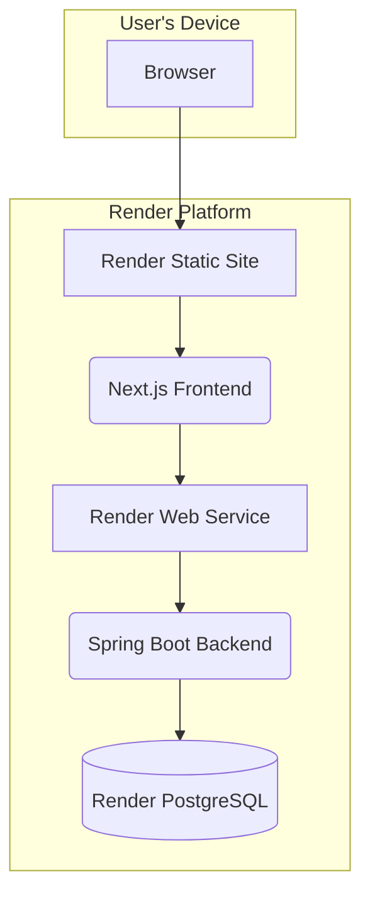

# 2. High Level Architecture (Revised)

## Technical Summary

This architecture outlines a modern, cloud-native web application designed for scalability and rapid development. The system features a decoupled frontend (Next.js) and backend (Spring Boot) housed within a monorepo to streamline development. Communication occurs via a secure REST API. The entire platform will be deployed on **Render**, leveraging its managed services to ensure reliability and focus on business logic.

## Platform and Infrastructure Choice

The project will be deployed on the **Render** cloud platform, which provides an integrated environment for web applications, services, and databases.

* **Key Services:**
    * **Static Site:** For hosting the Next.js frontend, providing a global CDN and continuous deployment from our Git repository.
    * **Web Service:** For hosting the Spring Boot backend, providing a scalable, managed environment.
    * **PostgreSQL:** For our managed database instance.

## Repository Structure

As decided in the PRD, we will use a **Monorepo**.

* **Monorepo Tool:** We will use **Turborepo** to manage the monorepo, which will help us manage the independent build and deployment processes for our frontend and backend services on Render.
* **Package Organization:** The monorepo will contain separate packages for the `frontend` application, the `backend` application, and a `shared` package for common code and types.

## High Level Architecture Diagram

## Architectural Patterns

* **Cloud-Native Application:** The system is designed to leverage a modern cloud platform (Render) for hosting, data, and deployment.
* **Decoupled Frontend/Backend:** The React/Next.js frontend is a separate application from the Spring Boot backend, allowing them to be developed, deployed, and scaled independently on Render.
* **Direct Service Communication:** The frontend application will communicate directly with the backend Web Service's public URL. Security and access control will be managed at the application level via authentication tokens.
* **Repository Pattern (Backend):** The backend will use the repository pattern to abstract data access logic, making the application more modular and easier to test. 